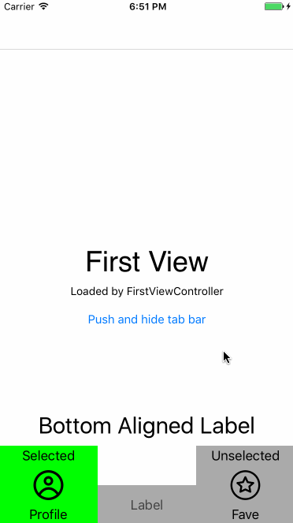
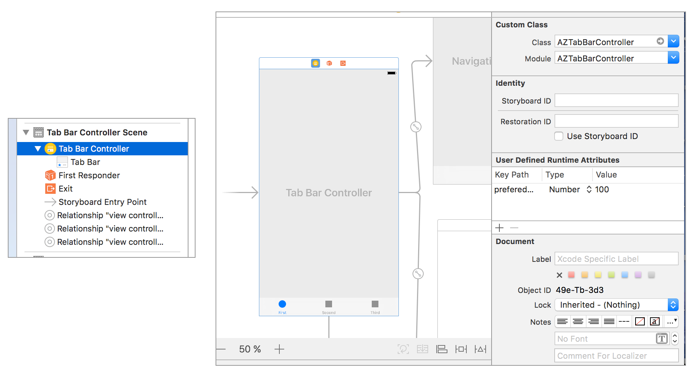
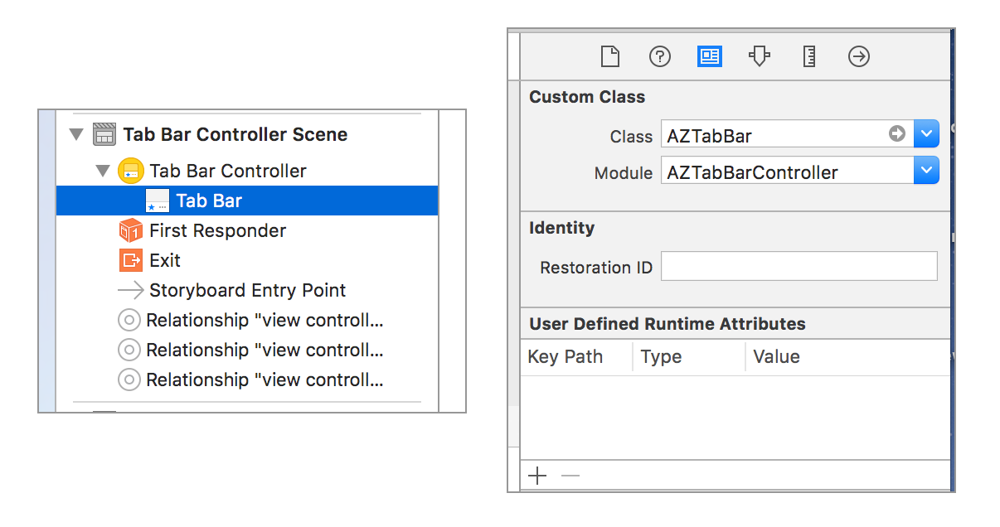
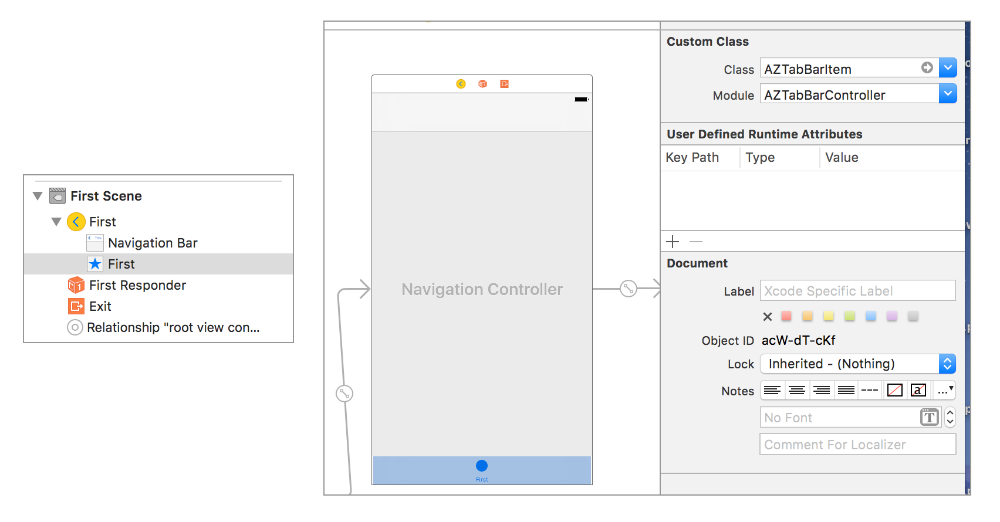

# AZTabBarController
[](https://img.shields.io/cocoapods/v/AZTabBarController.svg)
[](https://github.com/Carthage/Carthage)
[](http://cocoadocs.org/docsets/AZTabBarController)
[](http://twitter.com/ziminalex)


AZTabBarController helps to extend capabilities of default `UITabBarController` and create custom `UITabBar` items with custom appearance (with animations, layout and so on). Right now works only with storyboard setup (so your `UITabBarController` should be on storybaord).

## Visual Example

Inside this repository you can try `iOS Example` target with example of `AZTabBarController` implementation and custom items (`FashionTabBarItem.swift` and `MiddleTabBarItem`):



## Installation

- Add the following to your [`Podfile`](http://cocoapods.org/) and run `pod install`
```ruby
pod 'AZTabBarController'
```
- or add the following to your [`Cartfile`](https://github.com/Carthage/Carthage) and run `carthage update`
```ruby
github "azimin/AZTabBarController"
```
- or clone as a git submodule,

- or just copy `AZTabBarController/AZTabBarController.swift` and `AZTabBarController/UIView+Extensions.swift` into your project.

## AZTabBarController setup in storyboard

At first you should change `UITabBarController` to `AZTabBarController` on storyboard.



Then change `UITabBar` to `AZTabBar` on the same storyboard.



Then change all `UITabBarItem` to `AZTabBarItem` on this storyboard.



Also don't forget to implement code inside your view controllers for tab bar. This example you can find in Demo `iOS Example` project:

```swift
override func az_tabBarItemContentView() -> AZTabBarItemView {
  let tab = FashionTabBarItem.loadViewFromNib()
    
  tab.imageView.image = UIImage(named: "img_profile")
  tab.bottomLabel.text = "Profile"
    
  return tab
}
```

## Possible assertions

- `All tab bar items must be AZTabBarItem class` means one of your root view contllers on tab bar has `UITabBarItem` class instead of `AZTabBarItem`
- `tabBar class must be AZTabBar class` means you tabBar on UITabBarViewController is `UITabBar`, but should be `AZTabBar`

## Dynamic height

- You can setup default height on storybaord as @IBInspectable `AZTabBarController` property
- If you want to change height of tab bar, you can call (on any chird view controllers):
```
self.az_tabBarController?.preferedHeight = 125
```
This would change `Bottom Layout Guide`
- If you want to change height of specific items, you should use `heightValue` of your `AZTabBarItemView`, so it would be:
```
override func az_tabBarItemContentView() -> AZTabBarItemView {
  let tab = MiddleTabBarItem.loadViewFromNib()
    
  tab.heightValue = 50
    
  return tab
}
```
But pay attention that `Bottom Layout Guide` would use old value.
